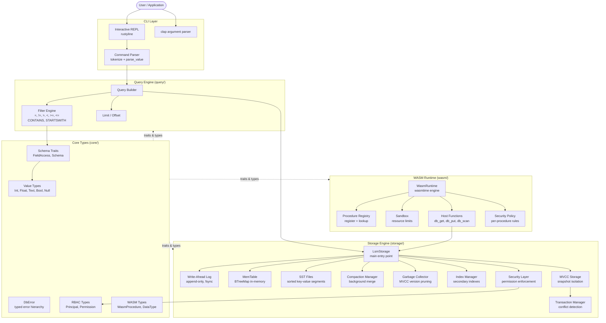
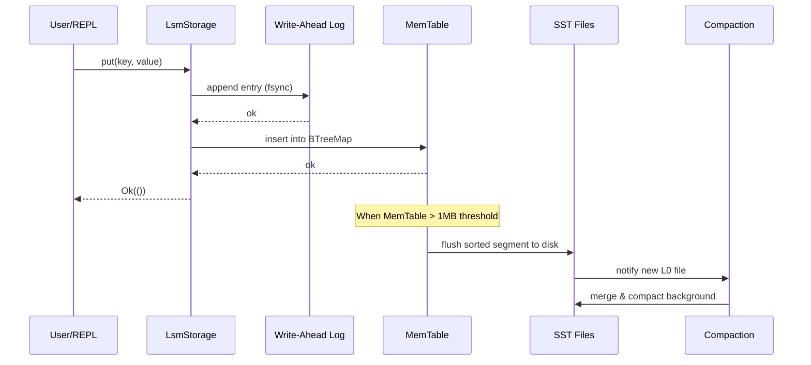
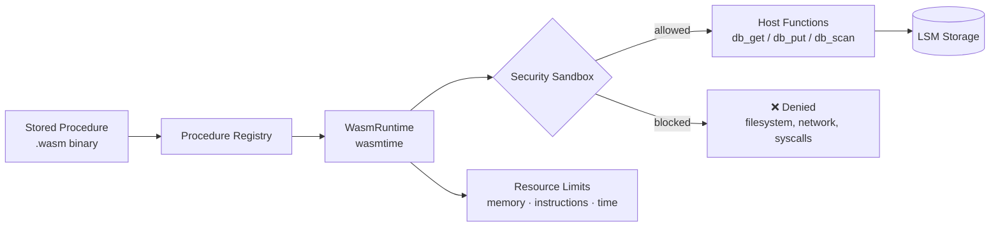

<div align="center">

# RustDB

**A high-performance, embeddable database engine written in Rust**

[](https://hub.docker.com/r/vansh5632/rustdb)
[](https://hub.docker.com/r/vansh5632/rustdb)
[](https://www.rust-lang.org)
[](LICENSE)
[](tests/)

LSM-tree storage · MVCC transactions · WASM stored procedures · RBAC security · Interactive REPL

</div>

---

## Table of Contents

- [Overview](#overview)
- [Architecture](#architecture)
- [Features](#features)
- [Quick Start](#quick-start)
  - [Docker (recommended)](#docker-recommended)
  - [Build from Source](#build-from-source)
- [REPL Reference](#repl-reference)
- [Storage Engine](#storage-engine)
- [Transactions](#transactions)
- [WASM Stored Procedures](#wasm-stored-procedures)
- [Security & RBAC](#security--rbac)
- [Docker Reference](#docker-reference)
- [Project Structure](#project-structure)
- [Testing](#testing)
- [Documentation](#documentation)

---

## Overview

RustDB is a from-scratch database engine built in Rust as a learning and exploration project for database internals. It implements core database concepts — including an LSM-tree storage backend, multi-version concurrency control, WebAssembly-powered stored procedures, and role-based access control — all accessible through an interactive SQL-like REPL.

The project demonstrates how foundational database components fit together, and ships as a single self-contained binary that you can pull from Docker Hub and run immediately.

---

## Architecture

### System Overview



### Write Path



### Transaction Lifecycle

```mermaid
stateDiagram-v2
    [*] --> Active : BEGIN / TransactionContext::new()
    Active --> Active : put() / delete() / get()
    Active --> Committed : commit()
    Active --> RolledBack : rollback()
    Active --> Aborted : conflict detected
    Committed --> [*]
    RolledBack --> [*]
    Aborted --> [*]

    note right of Active
        Snapshot taken at BEGIN.
        Writes buffered in pending_writes.
        Reads check own buffer first,
        then fall back to MVCC snapshot.
    end note

    note right of Committed
        Pending writes flushed atomically.
        Version timestamp incremented.
        Old versions eligible for GC.
    end note
```

### WASM Execution Sandbox



---

## Features

| Feature | Details |
|---|---|
| **LSM-tree Storage** | Write-optimized. WAL for durability, in-memory BTreeMap MemTable, sorted SST files on disk |
| **Background Compaction** | Merges L0→L1 SST segments in the background; configurable strategy and thresholds |
| **MVCC Transactions** | Snapshot isolation. Each transaction sees a consistent point-in-time view; commit/rollback; conflict detection |
| **Garbage Collection** | Background GC prunes old MVCC versions no longer needed by any active snapshot |
| **Secondary Indexes** | `IndexManager` supports Hash and BTree index types on any column |
| **WASM Stored Procedures** | Load any `.wasm` binary as a stored procedure; sandboxed with resource limits; host functions bridge WASM ↔ storage |
| **RBAC Security** | `Principal` + `Permission` model; field-level `ReadTable`, `WriteTable`, `DeleteTable`, `CreateTable`, `DropTable`, `ExecuteProcedure`, `Admin`; audit log |
| **Encryption** | `EncryptionConfig` with pluggable `EncryptionAlgorithm` (AES-256-GCM, ChaCha20-Poly1305) |
| **Interactive REPL** | SQL-like syntax; readline history; pretty-printed aligned tables; WHERE filters; LIMIT |
| **Async / Tokio** | Fully async API built on `tokio`; blocking I/O offloaded |
| **Non-root Docker** | Runs as dedicated `rustdb` user inside container |

---

## Quick Start

### Docker (recommended)

Pull and run the interactive REPL immediately — no Rust installation needed:

```bash
docker pull vansh5632/rustdb:latest

# Interactive REPL with persistent storage
docker run -it --rm \
  -v rustdb-data:/data \
  vansh5632/rustdb:latest

# Run the built-in demo and exit
docker run --rm vansh5632/rustdb:latest --demo
```

#### Docker Compose

```yaml
# docker-compose.yml
services:
  rustdb:
    image: vansh5632/rustdb:latest
    stdin_open: true
    tty: true
    volumes:
      - rustdb-data:/data
    environment:
      - RUSTDB_DATA_DIR=/data

  # Demo profile: docker compose --profile demo up
  rustdb-demo:
    image: vansh5632/rustdb:latest
    profiles: [demo]
    command: ["--demo", "--data-dir", "/data"]
    volumes:
      - rustdb-demo-data:/data

volumes:
  rustdb-data:
  rustdb-demo-data:
```

```bash
docker compose up                        # interactive REPL
docker compose --profile demo up         # run demo
```

### Build from Source

**Requirements:** Rust 1.82+, CMake, pkg-config, libssl-dev

```bash
git clone https://github.com/Vansh5632/rustty.git
cd rustty

# Run the demo
cargo run --release -- --demo

# Interactive REPL
cargo run --release -- --data-dir ./mydata

# Run all 31 tests
cargo test
```

---

## REPL Reference

Once inside the REPL (`rustdb> ` prompt), use these commands:

### Table Management

```sql
-- Create a table with named columns
CREATE TABLE users (name, age, email)

-- List all tables in the current database
TABLES

-- Drop a table and all its data permanently
DROP TABLE users
```

### Inserting Data

Values are type-inferred: integers, floats, `'quoted strings'`, `true`/`false`, `null`.

```sql
INSERT INTO users (name, age, email) VALUES ('Alice', 30, 'alice@example.com')
INSERT INTO users (name, age, active) VALUES ('Bob', 25, true)
INSERT INTO products (name, price, stock) VALUES ('Widget', 9.99, 100)
```

### Querying Data

```sql
-- Select all rows
SELECT FROM users

-- Filter with WHERE clause
SELECT FROM users WHERE age > 25
SELECT FROM users WHERE name = 'Alice'
SELECT FROM users WHERE active = true
SELECT FROM users WHERE email CONTAINS '@example'
SELECT FROM users WHERE name STARTSWITH 'A'

-- Compound: filter + limit
SELECT FROM users WHERE age >= 18 LIMIT 10

-- Get a single row by auto-assigned primary key (_id)
GET users _id 1
```

**Supported operators:**

| Operator | Example |
|---|---|
| `=` | `WHERE name = 'Alice'` |
| `!=` | `WHERE status != 'inactive'` |
| `>` | `WHERE age > 30` |
| `<` | `WHERE price < 50` |
| `>=` | `WHERE score >= 90` |
| `<=` | `WHERE weight <= 200` |
| `CONTAINS` | `WHERE email CONTAINS 'gmail'` |
| `STARTSWITH` | `WHERE name STARTSWITH 'A'` |

### Deleting Data

```sql
-- Delete rows matching a condition
DELETE FROM users WHERE age < 18
DELETE FROM users WHERE active = false

-- Delete a specific row by primary key
DELETE FROM users WHERE _id = 3
```

### Aggregation & Utility

```sql
COUNT users          -- count all rows in a table
HELP                 -- show command reference
EXIT                 -- quit (also Ctrl+D)
```

### REPL Features

- **Arrow key history** — navigate previous commands
- **Persistent history** — saved to `<data-dir>/.rustdb_history` between sessions
- **Pretty-printed tables** — aligned columns with row counts
- **Type inference** — no need to declare types on insert

---

## Storage Engine

RustDB's storage layer (`storage/`) is a hand-built LSM-tree:

```
write ──► WAL (append-only, fsync) ──► MemTable (BTreeMap)
                                              │
                                    (flush when > 1MB)
                                              │
                                              ▼
                                    L0 SST files (sorted)
                                              │
                                    (background compaction)
                                              │
                                    L1+ SST files (merged)
```

**Key components:**

| Component | File | Role |
|---|---|---|
| `LsmStorage` | `storage/src/lib.rs` | Main public API |
| `WriteAheadLog` | `storage/src/lib.rs` | Durability — append before write |
| `MvccStorage` | `storage/src/mvcc.rs` | MVCC version chains |
| `TransactionManager` | `storage/src/mvcc.rs` | Conflict detection & commit |
| `CompactionManager` | `storage/src/compaction.rs` | Background SST merging |
| `GarbageCollector` | `storage/src/garbage_collector.rs` | Old version pruning |
| `IndexManager` | `storage/src/index.rs` | Secondary index CRUD |
| `SecurityLayer` | `storage/src/security_layer.rs` | Permission enforcement at storage boundary |

---

## Transactions

RustDB implements snapshot isolation via MVCC:

```rust
// Rust API example
let storage = MvccLsmStorage::new("./data")?;
let mut tx = TransactionContext::new(&storage).await;

tx.transaction_mut().put("key1", b"value1")?;
tx.transaction_mut().put("key2", b"value2")?;

// Commit atomically
tx.commit().await?;

// Or roll back all writes
tx.rollback().await?;
```

- Each transaction receives a **snapshot timestamp** at `BEGIN`
- Writes are **buffered** in the transaction until commit
- Commit checks for **write-write conflicts** before applying
- Rolled-back or conflicted transactions leave **no trace** in storage
- Background GC prunes version chains when no active snapshot references them

---

## WASM Stored Procedures

Custom logic runs inside a sandboxed WebAssembly environment:

```
.wasm binary
     │
     ▼
ProcedureRegistry.register("my_proc", wasm_bytes)
     │
     ▼
WasmRuntime.execute("my_proc", args)
     │
     ├── SecurityPolicy  ← per-procedure permission rules
     ├── ResourceLimits  ← max memory, instruction count, wall time
     └── HostFunctions   ← db_get / db_put / db_scan (only allowed calls)
```

A sample procedure written in WebAssembly Text format is included at [`fixtures/calculate_tax.wat`](fixtures/calculate_tax.wat).

See [`WASM_SECURITY.md`](WASM_SECURITY.md) for the full sandboxing threat model.

---

## Security & RBAC

The RBAC system (`core/src/security.rs`, `storage/src/security_layer.rs`) enforces access control at the storage boundary:

```
┌─────────────┐    ┌──────────────────┐    ┌──────────────┐
│  Principal  │───►│  SecurityContext  │───►│ AccessDecision│
│  id, roles  │    │  operation+resource│   │ Allow / Deny │
│  permissions│    └──────────────────┘    └──────────────┘
└─────────────┘
```

**Built-in permissions:**

| Permission | Scope |
|---|---|
| `ReadTable(name)` | SELECT on a specific table |
| `WriteTable(name)` | INSERT/UPDATE on a specific table |
| `DeleteTable(name)` | DELETE on a specific table |
| `CreateTable` | CREATE TABLE |
| `DropTable` | DROP TABLE |
| `ExecuteProcedure(name)` | Call a specific WASM stored procedure |
| `ManageUsers` | Create/modify principals |
| `Admin` | All operations |

All access decisions are written to an **audit log** (`AuditLogEntry`) for compliance.  
Encryption at rest is supported via `EncryptionConfig` (AES-256-GCM / ChaCha20-Poly1305).

See [`PRODUCTION_READINESS.md`](PRODUCTION_READINESS.md) for the full production hardening checklist.

---

## Docker Reference

### Image Details

| Property | Value |
|---|---|
| Base image | `debian:bookworm-slim` |
| Image size | ~131 MB |
| Runs as | `rustdb` (non-root) |
| Data directory | `/data` (volume) |
| Docker Hub | [`vansh5632/rustdb`](https://hub.docker.com/r/vansh5632/rustdb) |

### Environment Variables

| Variable | Default | Description |
|---|---|---|
| `RUSTDB_DATA_DIR` | `/data` | Path where RustDB stores data files and WAL |

### Available Tags

| Tag | Description |
|---|---|
| `latest` | Latest stable build |
| `0.1.0` | Initial release |

### Common Docker Commands

```bash
# Pull
docker pull vansh5632/rustdb:latest

# Interactive REPL
docker run -it --rm -v rustdb-data:/data vansh5632/rustdb:latest

# Demo mode
docker run --rm vansh5632/rustdb:latest --demo

# Custom data directory on host
docker run -it --rm -v /path/on/host:/data vansh5632/rustdb:latest

# Custom data dir via env
docker run -it --rm \
  -v rustdb-data:/mydb \
  -e RUSTDB_DATA_DIR=/mydb \
  vansh5632/rustdb:latest --data-dir /mydb
```

---

## Project Structure

```
Rustdb/
├── src/
│   └── main.rs              # CLI entrypoint, REPL, command dispatcher
├── core/
│   └── src/
│       ├── lib.rs            # DbError, Database/MvccDatabase traits, Value types
│       ├── security.rs       # Principal, Permission, SecurityContext, AuditLog
│       ├── compaction.rs     # CompactionConfig, GcConfig, stats types
│       └── wasm.rs           # WasmProcedure, WasmValue, execution types
├── storage/
│   └── src/
│       ├── lib.rs            # LsmStorage, WriteAheadLog, MemTable, SST
│       ├── mvcc.rs           # MvccStorage, TransactionManager, TransactionContext
│       ├── compaction.rs     # CompactionManager, BackgroundCompactor
│       ├── garbage_collector.rs  # GarbageCollector, BackgroundGc
│       ├── index.rs          # IndexManager, IndexDescriptor
│       └── security_layer.rs # SecurityLayer (storage-level permission checks)
├── query/
│   └── src/
│       ├── lib.rs            # QueryBuilder, Filter, Operator, execution
│       └── transaction.rs    # Transactional query helpers
├── schema/
│   └── src/
│       └── lib.rs            # Schema, FieldAccess traits
├── wasm/
│   └── src/
│       ├── lib.rs            # WasmProcedureRuntime (public API)
│       ├── runtime.rs        # WasmRuntime (wasmtime engine wrapper)
│       ├── registry.rs       # ProcedureRegistry, StoredProcedure
│       ├── sandbox.rs        # ResourceLimits, SecurityPolicy
│       └── host_functions.rs # db_get / db_put / db_scan host bindings
├── server/
│   └── src/
│       └── main.rs           # (reserved for future HTTP/gRPC server)
├── tests/
│   ├── storage_tests.rs      # 11 storage engine tests
│   ├── query_tests.rs        # 10 query engine tests
│   ├── transaction_tests.rs  # 7 MVCC transaction tests
│   └── cli_tests.rs          # 3 CLI/binary integration tests
├── examples/
│   ├── basic.rs              # Basic put/get/scan example
│   ├── advanced.rs           # Compaction + index example
│   ├── transaction.rs        # MVCC transaction example
│   └── wasm_security.rs      # WASM + RBAC example
├── fixtures/
│   └── calculate_tax.wat     # Sample WASM stored procedure (WAT format)
├── Dockerfile                # Multi-stage build → debian:bookworm-slim runtime
├── docker-compose.yml        # REPL + demo profiles
├── PRODUCTION_READINESS.md   # Production hardening checklist
└── WASM_SECURITY.md          # WASM sandbox threat model
```

---

## Testing

31 tests across 4 test suites, all passing:

```bash
cargo test
```

| Suite | Tests | What it covers |
|---|---|---|
| `storage_tests` | 11 | put/get, overwrite, delete tombstone, scan prefix, WAL persistence, serialization |
| `query_tests` | 10 | filter operators, LIMIT, combined filters, empty tables, schema access |
| `transaction_tests` | 7 | commit, rollback, multi-write, delete, MVCC scan, concurrent transactions |
| `cli_tests` | 3 | binary help/version flags, demo mode end-to-end |

---

## Documentation

| Document | Contents |
|---|---|
| [docs/INTERNALS.md](docs/INTERNALS.md) | Deep-dive into storage engine, MVCC, compaction, and query pipeline internals |
| [WASM_SECURITY.md](WASM_SECURITY.md) | WASM sandbox threat model, resource limits, host function policy |
| [PRODUCTION_READINESS.md](PRODUCTION_READINESS.md) | Production hardening checklist |

---

<div align="center">

Built with Rust · [Docker Hub](https://hub.docker.com/r/vansh5632/rustdb) · [GitHub](https://github.com/Vansh5632/rustty)

</div>
