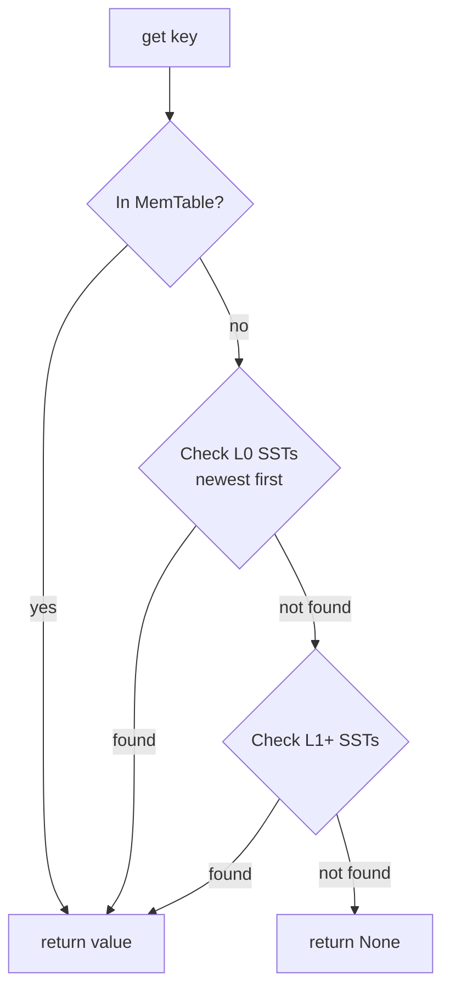
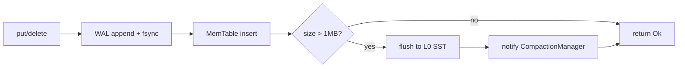
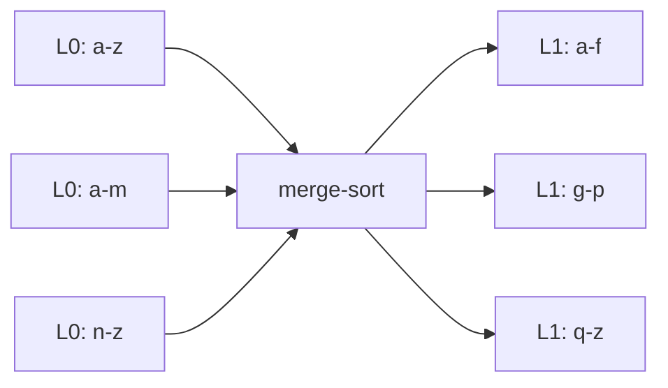
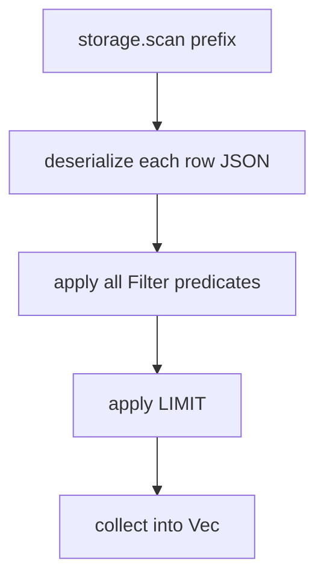
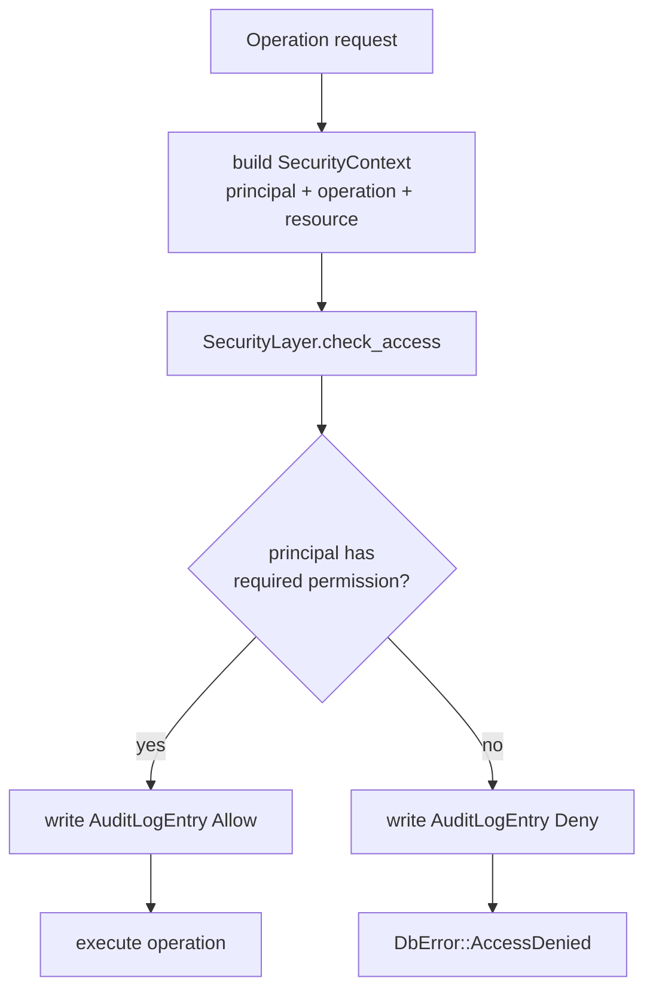

# RustDB Internals

A deep-dive into the storage engine, query pipeline, MVCC layer, compaction, and WASM runtime.

---

## Table of Contents

- [Storage Engine](#storage-engine)
  - [Write-Ahead Log (WAL)](#write-ahead-log-wal)
  - [MemTable](#memtable)
  - [SST Files](#sst-files)
  - [Read Path](#read-path)
  - [Write Path](#write-path)
- [MVCC & Transactions](#mvcc--transactions)
  - [Version Chains](#version-chains)
  - [Snapshot Isolation](#snapshot-isolation)
  - [Conflict Detection](#conflict-detection)
- [Compaction](#compaction)
- [Garbage Collection](#garbage-collection)
- [Secondary Indexes](#secondary-indexes)
- [Query Pipeline](#query-pipeline)
- [WASM Runtime Internals](#wasm-runtime-internals)
- [Security Layer Internals](#security-layer-internals)
- [Error Hierarchy](#error-hierarchy)

---

## Storage Engine

The storage backend (`storage/`) is a hand-built Log-Structured Merge-Tree (LSM-tree). LSM-trees trade read amplification for dramatically improved write throughput — every write goes to an in-memory structure and a sequential append log, never a random-access B-tree node.

### Write-Ahead Log (WAL)

```
storage/src/lib.rs → WriteAheadLog
```

Before any write touches the MemTable, it is appended to the WAL:

```
┌──────────────────────────────────────────────────────────┐
│  WAL file  (append-only, BufWriter + fsync on flush)     │
│                                                          │
│  [entry][entry][entry][entry] ...                        │
│                                                          │
│  Each entry: serialized (key, value, timestamp, op_type) │
└──────────────────────────────────────────────────────────┘
```

**Recovery:** On startup, RustDB replays all WAL entries whose corresponding MemTable flush has not yet occurred, guaranteeing durability even after a crash.

**Durability guarantee:** A write is durable as soon as the WAL entry is fsynced, before the caller receives `Ok(())`.

### MemTable

```
storage/src/lib.rs → MemTable (BTreeMap<Vec<u8>, Vec<u8>>)
```

The MemTable is an in-memory, sorted key-value store backed by a `BTreeMap`. Writes land here after the WAL. Reads check the MemTable first before going to disk.

**Flush threshold:** When the MemTable exceeds 1 MB (configurable via `FLUSH_THRESHOLD`), it is frozen and flushed to a new L0 SST file on disk. A new empty MemTable takes its place.

### SST Files

Sorted String Tables are immutable files written during MemTable flush. Each SST contains key-value pairs in sorted order. L0 files may have overlapping key ranges; compaction merges them into non-overlapping L1+ files.

```
L0:  [a-z]  [a-m]  [n-z]   ← overlapping ranges, newest first
L1:  [a-f]  [g-p]  [q-z]   ← non-overlapping, merged
```

### Read Path



**Read amplification:** In the worst case, a read checks the MemTable plus every L0 file plus one file per level. Bloom filters (planned) would reduce this to O(1) for non-existent keys.

### Write Path



---

## MVCC & Transactions

```
storage/src/mvcc.rs → MvccStorage, TransactionManager, TransactionContext
```

RustDB uses Multi-Version Concurrency Control to allow concurrent readers and writers without locking.

### Version Chains

Every key stores a list of `(timestamp, value)` pairs — its **version chain**:

```
key "users:1:name"
  → [(ts=1, "Alice"), (ts=5, "Alicia"), (ts=9, DELETED)]
```

A transaction reading at snapshot timestamp `ts=6` will see `"Alicia"` (the version at `ts=5`, the latest ≤ 6).

### Snapshot Isolation

When a transaction begins, it captures the current global timestamp as its **snapshot timestamp**. All reads made by the transaction see the database as it was at that instant — no writes from concurrent transactions are visible, preventing phantom reads and non-repeatable reads.

```
Timeline ──────────────────────────────────►
           ts=1    ts=5    ts=6    ts=9
            │       │       │       │
Tx A begins at ts=4 ──────►│       │
  reads see ts=1 and ts=3 versions  │
  cannot see ts=5 (written after snapshot)
```

### Conflict Detection

At commit time, `TransactionManager` checks whether any key in the transaction's write set was modified by another committed transaction after this transaction's snapshot timestamp. If so, the transaction is **aborted** with `DbError::TransactionConflict` — the caller must retry.

```
Tx A (snapshot=4): writes key K
Tx B (snapshot=4): writes key K → commits at ts=6
Tx A commits → CONFLICT → abort
```

This is a **first-committer-wins** strategy (optimistic concurrency control).

---

## Compaction

```
storage/src/compaction.rs → CompactionManager, BackgroundCompactor
```

As more MemTable flushes produce L0 SST files, read amplification grows. Compaction merges multiple SST files into fewer, larger, non-overlapping files:



**During compaction:**
- Duplicate keys are resolved: only the most recent version survives
- Tombstone (`delete`) entries are dropped once all older versions are pruned
- Output files are written atomically; old files are removed only after the new ones are durable

**`CompactionStats`** tracks bytes read/written, files merged, and duration for observability.

---

## Garbage Collection

```
storage/src/garbage_collector.rs → GarbageCollector, BackgroundGc
```

The GC runs in the background and removes MVCC version chains entries that cannot be seen by any active transaction:

1. Determine the **minimum active snapshot timestamp** across all open transactions
2. For each key, drop all versions with `timestamp < min_snapshot` except the most recent one
3. Reclaim disk space

`GcStats` reports versions pruned and bytes reclaimed per GC cycle.

---

## Secondary Indexes

```
storage/src/index.rs → IndexManager, IndexDescriptor, IndexType
```

Secondary indexes map a column value to the set of primary keys that have that value:

```
IndexType::Hash   → HashMap<value, BTreeSet<_id>>   (O(1) point lookup)
IndexType::BTree  → BTreeMap<value, BTreeSet<_id>>  (O(log n), supports range scans)
```

Index entries are maintained on every `put` and `delete` through `IndexManager`. The query engine can use an index to avoid full-table scans when a filter matches an indexed column.

---

## Query Pipeline

```
query/src/lib.rs → QueryBuilder, Filter, Operator
```

Queries flow through a simple, composable pipeline:

```
QueryBuilder::new(storage)
  .filter("age", Operator::Gt, Value::Int(25))
  .filter("active", Operator::Eq, Value::Bool(true))
  .limit(10)
  .execute()
  .await
```

**Execution:**



**Filter operators** (`query/src/lib.rs → Operator`):

| Operator | Types supported |
|---|---|
| `Eq`, `Ne` | all Value types |
| `Gt`, `Lt`, `Gte`, `Lte` | Int, Float |
| `Contains` | Text (substring) |
| `StartsWith` | Text (prefix) |

Each row is deserialized via the `Schema` + `FieldAccess` traits defined in `schema/src/lib.rs`, allowing the filter engine to access typed fields without knowing the concrete row type at compile time.

---

## WASM Runtime Internals

```
wasm/src/runtime.rs    → WasmRuntime (wasmtime engine)
wasm/src/registry.rs   → ProcedureRegistry
wasm/src/sandbox.rs    → ResourceLimits, SecurityPolicy
wasm/src/host_functions.rs → db_get / db_put / db_scan
```

### Load & Execute Flow

```
register("proc_name", wasm_bytes)
  └── compile wasm_bytes with wasmtime::Engine
  └── store Module in ProcedureRegistry

execute("proc_name", args, context)
  └── lookup Module in registry
  └── create Store with ResourceLimits (fuel = max instructions)
  └── check SecurityPolicy for this procedure + principal
  └── instantiate Module with HostFunctions linker
  └── call exported "run" function
  └── collect WasmExecutionResult
```

### Resource Limits (`sandbox.rs`)

Each procedure execution is constrained by `ResourceLimits`:

| Limit | Controls |
|---|---|
| `max_memory_bytes` | Linear memory pages the module can allocate |
| `max_instructions` | Wasmtime fuel consumed per instruction |
| `max_execution_time` | Wall-clock timeout |

Exceeding any limit raises `DbError::Wasm`.

### Host Functions (`host_functions.rs`)

The only way WASM code can interact with the outside world is through the explicitly exported host functions:

| Host function | Signature | Description |
|---|---|---|
| `db_get` | `(key_ptr, key_len) → value_ptr` | Read one key from storage |
| `db_put` | `(key_ptr, key_len, val_ptr, val_len)` | Write one key-value pair |
| `db_scan` | `(prefix_ptr, prefix_len) → count` | Scan keys with a prefix |

All other WASI/syscall imports are blocked at link time — the sandbox cannot access the filesystem, network, environment variables, or OS signals.

---

## Security Layer Internals

```
core/src/security.rs         → Principal, Permission, SecurityContext, AccessDecision
storage/src/security_layer.rs → SecurityLayer
```

### Decision Flow



### Audit Log

Every access decision — allowed or denied — is appended to an `AuditLogEntry`:

```rust
pub struct AuditLogEntry {
    pub timestamp: u64,
    pub principal_id: String,
    pub operation: OperationType,
    pub resource: Resource,
    pub decision: AccessDecision,
    pub reason: Option<String>,
}
```

This provides a tamper-evident record of all data access for compliance purposes.

---

## Error Hierarchy

All errors are typed variants of `DbError` (`core/src/lib.rs`):

| Variant | When raised |
|---|---|
| `Storage(String)` | Low-level I/O or SST errors |
| `Query(String)` | Invalid query construction |
| `Schema(String)` | Field access on unknown column |
| `Serialization(String)` | JSON encode/decode failure |
| `TransactionConflict(String)` | Write-write conflict at commit |
| `Transaction(String)` | General transaction error |
| `Deadlock(String)` | Deadlock detected (future) |
| `Compaction(String)` | Compaction I/O failure |
| `GarbageCollection(String)` | GC failure |
| `Security(String)` | Security policy violation |
| `Wasm(String)` | WASM execution error |
| `AccessDenied(String)` | RBAC permission denied |
| `Encryption(String)` | Encrypt/decrypt failure |
| `NotFound` | Key does not exist |
| `InvalidInput(String)` | Caller passed bad arguments |

All public APIs return `Result<T> = std::result::Result<T, DbError>`.
